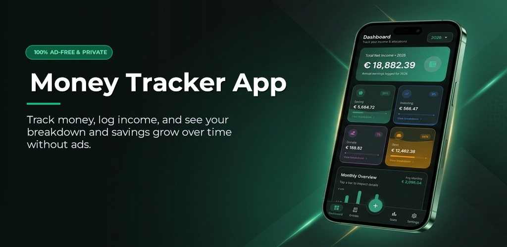

# 💰 Money Tracker Web

  
    
  

 

Official web landing page and companion site for **Money Tracker App** — a modern, privacy-first personal salary and income tracking Android application built with Jetpack Compose and Firebase.

> [!NOTE]
> This repository hosts the web landing page, legal privacy policy, and account data deletion portal for the Money Tracker ecosystem.

---

## ✨ Key App Features

- **🚫 100% Ad-Free & Private**: No interruptions, no banners, no analytics tracking or selling your financial data.
- **⚡ Dynamic Allocation Engine**: Automatically splits every income entry into customizable buckets: **Saving** (30%), **Investing** (3%), **Donate** (1%), and **Rest** (66%).
- **🧮 Inline Math Input**: Type mathematical expressions (e.g. `(33+17)-10` or `905.95`) directly into the salary field for instant evaluation.
- **📊 Interactive Monthly Bar Chart**: 12-month calendar overview (Jan–Dec) with automatic peak earning (**Best Month**) and lowest earning (**Low Month**) badges.
- **💼 Multi-Tier Income Sources**: Categorize income into primary sources (*Job*, *Business*, *Freelancing*, *Govt Benefits*, *Gifts*) and custom sub-sources (*Upwork*, *Fiverr*, *Stripe*, *Direct*, *PayPal*) with inline sub-source creation.
- **📈 All-Time Lifetime Statistics**: Multi-year totals, lifetime savings/investments/donations, recorded year averages, and total entry counters.
- **🔒 Secure Cloud Sync & Offline Support**: Powered by Firebase Cloud Firestore with offline persistence — log entries anywhere, anytime.
- **🌓 Dynamic UI & Screenshot Showcase**: Sleek dark and crisp light themes with responsive screenshot previews on the web.

---

## 🚀 Web Tech Stack

- **Structure**: Semantic HTML5 (Mobile-first responsive design)
- **Styling**: [Tailwind CSS](https://tailwindcss.com/) + Custom CSS for glassmorphism and bento-card layouts
- **Animations**: [GSAP](https://greensock.com/gsap/) & ScrollTrigger for smooth reveal-on-scroll effects
- **Interactivity**: Vanilla JavaScript for theme switching (Dark/Light screenshot switcher) and mobile menu navigation

---

## 🤝 Support the Mission

Money Tracker App is committed to remaining 100% ad-free. If this project helps you manage your finances, consider supporting its maintenance and future development:

- **International**: [Donate via Stripe](https://donate.stripe.com/3cI8wO6bWcqd7F46az8AE01)
- **Bangladesh**: bKash Send Money to `01773615582` (Personal)

---

## ⚖️ License

Distributed under the MIT License. See `LICENSE` for more information.

---

Built with ❤️ by [Sahed Alom Sumit](https://sahedalomsumit.com)
